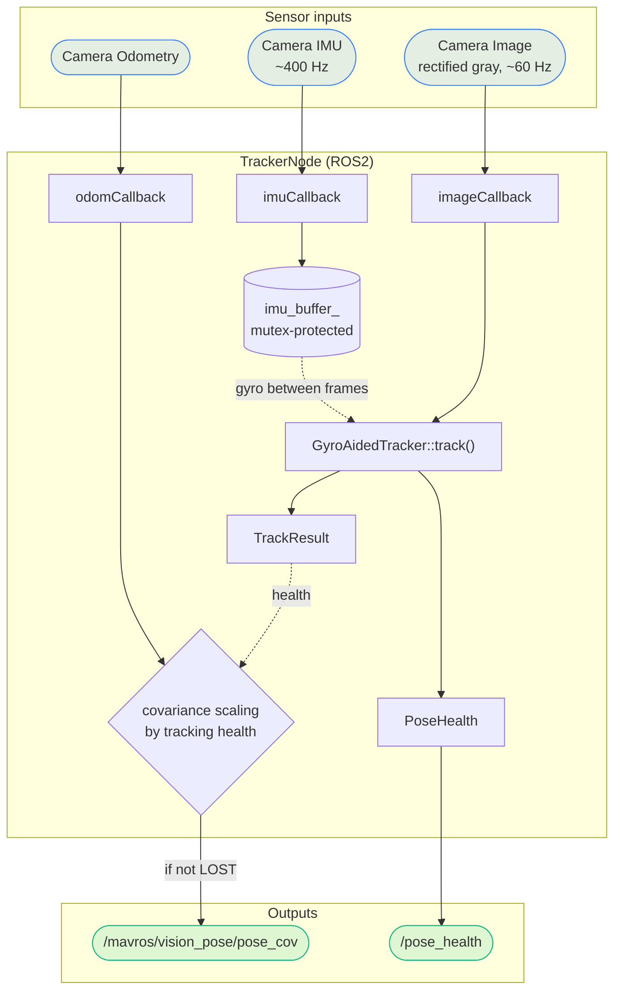
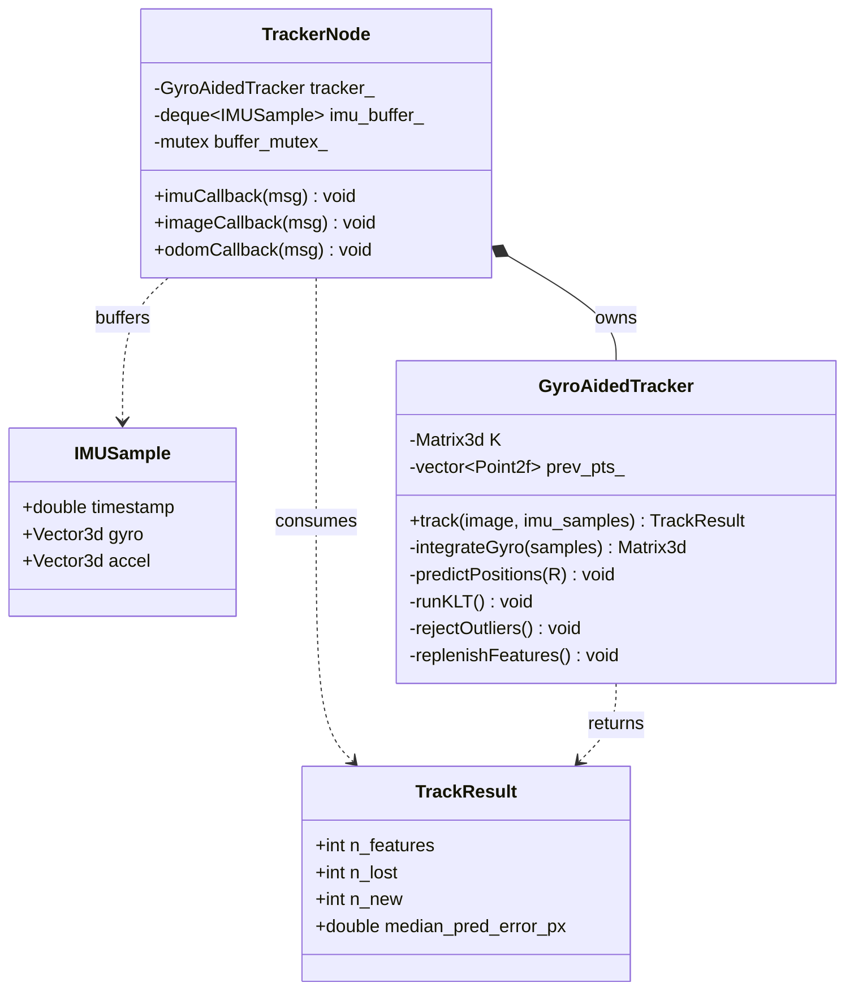
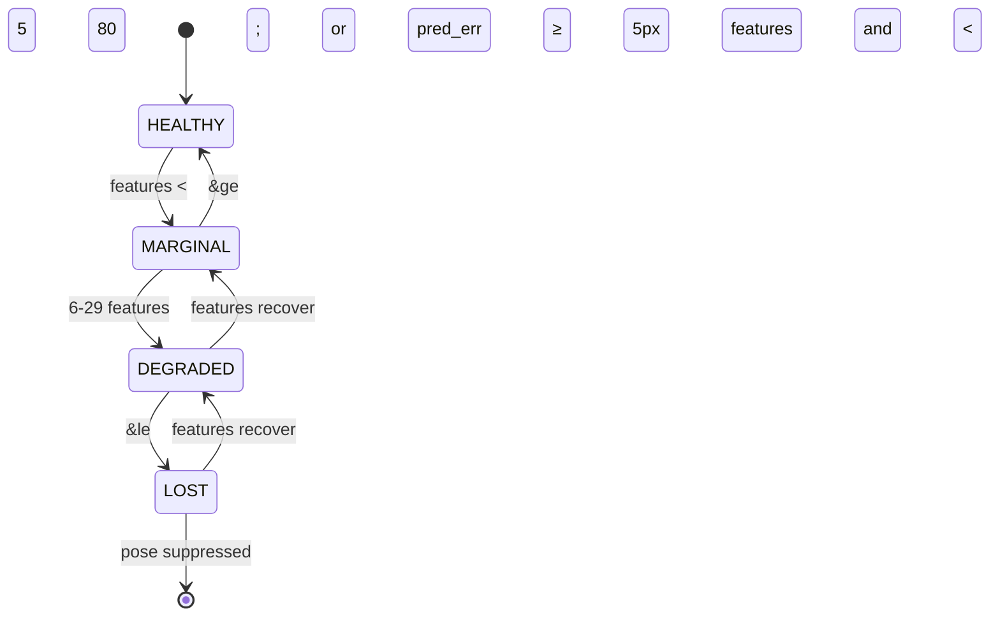

# gyro_aided_tracker_cpp

A ROS2 (Humble) C++ node that fuses IMU gyroscope data with KLT optical-flow
tracking to produce robust, low-latency visual feature tracking for a
stereo-inertial camera. Pose estimates are forwarded to a flight controller via
MAVROS with covariance scaled by tracking health.

---

## How It Works

Standard KLT tracking fails during fast motion because features move far between
frames. This node solves that by:

1. **Integrating gyro samples** between two image frames using Rodrigues'
   rotation formula to get a rotation matrix `R`.
2. **Predicting feature positions** in the new frame via the homography
   `H = K * R * K^-1`, projecting each tracked point through the camera intrinsics.
3. **Running KLT** (`calcOpticalFlowPyrLK`) with the gyro-predicted positions as
   the initial guess (smaller search window needed, fewer false matches).
4. **Rejecting outliers** with RANSAC (`findHomography`) on the surviving point pairs.
5. **Replenishing features** with grid-based `goodFeaturesToTrack` when the count
   drops below a threshold.
6. **Scaling pose covariance** based on tracking health before publishing to MAVROS.

### Processing pipeline

```mermaid
flowchart LR
    A["Integrate gyro<br/>Rodrigues &rarr; R"] --> B["Predict positions<br/>H = K&middot;R&middot;K&#8315;&#185;"]
    B --> C["KLT optical flow<br/>gyro-seeded guess"]
    C --> D["RANSAC reject<br/>findHomography"]
    D --> E{"features<br/>&lt; min?"}
    E -- yes --> F["Replenish<br/>grid goodFeaturesToTrack"]
    E -- no --> G["Scale covariance<br/>by tracking health"]
    F --> G
    G --> H["Publish to MAVROS"]

    classDef io fill:#10b98122,stroke:#10b981;
    class A,H io;
```



---

## System Architecture

Two asynchronous sensor streams feed the node: a high-rate IMU and a lower-rate
image stream. Gyro samples are buffered (mutex-protected) and consumed by the
tracker on each new frame. The tracker emits both a `TrackResult` (used to scale
covariance) and a `PoseHealth` diagnostic. Visual odometry is fused in and, when
tracking is healthy enough, a covariance-scaled pose is published to MAVROS.



### Classes

| Class | Role |
|-------|------|
| `IMUSample` | Timestamped gyro + accel measurement |
| `TrackResult` | Per-frame stats: feature count, lost, new, median prediction error |
| `GyroAidedTracker` | Pure CV/Eigen algorithm class with no ROS dependency |
| `TrackerNode` | ROS2 node that wires subscriptions and publishes results |

The design deliberately keeps the algorithm (`GyroAidedTracker`) free of any ROS
dependency, so it can be unit-tested and reused independently of the node
(`TrackerNode`) that wires it into the ROS2 graph.



> The class members above are representative of the design described in this
> README; adjust the exact fields/signatures to match the source if they differ.

---

## Topics

| Topic | Type | Direction | Description |
|-------|------|-----------|-------------|
| `/camera/imu/data` | `sensor_msgs/Imu` | Sub | Raw IMU at ~400 Hz |
| `/camera/left/image_rect_gray` | `sensor_msgs/Image` | Sub | Rectified grayscale at ~60 Hz |
| `/camera/odom` | `nav_msgs/Odometry` | Sub | Visual odometry |
| `/mavros/vision_pose/pose_cov` | `geometry_msgs/PoseWithCovarianceStamped` | Pub | Covariance-scaled pose for FCU |
| `/pose_health` | `gyro_aided_tracker_cpp/PoseHealth` | Pub | Tracking diagnostics at image rate |

---

## Custom Message - `PoseHealth.msg`

```
std_msgs/Header header
int32   n_features            # active tracked features
int32   n_lost                # features dropped this frame
int32   n_new                 # features detected this frame
float32 median_pred_error_px  # median gyro-prediction vs KLT residual (px)
float32 gyro_magnitude_dps    # gyro magnitude (deg/s)
float32 accel_magnitude       # accelerometer magnitude (m/s^2)
uint8   tracking_state        # 0=HEALTHY 1=MARGINAL 2=DEGRADED 3=LOST
float32 covariance_scale      # multiplier applied to position covariance
```

---

## Tracking States and Covariance Scaling

| State | Condition | Covariance scale |
|-------|-----------|-----------------|
| `0` HEALTHY | >= 80 features and pred_err < 5 px | x 1 |
| `1` MARGINAL | >= 30 features or pred_err >= 5 px | x 3 |
| `2` DEGRADED | 6 to 29 features | x 10 |
| `3` LOST | <= 5 features | pose suppressed |

When LOST, the node logs a throttled warning and skips publishing to MAVROS entirely.



---

## Parameters (hardcoded - edit `TrackerNode` constructor)

| Parameter | Value | Description |
|-----------|-------|-------------|
| `fx`, `fy` | 527.0 | Focal lengths (px) |
| `cx`, `cy` | 640.0, 360.0 | Principal point (px) |
| `max_features` | 200 | Maximum tracked features |
| `min_features` | 50 | Replenishment threshold |
| `grid_size` | 8 | NxN grid for feature detection |
| `klt_win_size` | 7 | KLT half-window -> 15x15 patch |
| `ransac_thresh` | 1.5 px | RANSAC inlier distance |

---

## Dependencies

- ROS2 Humble
- OpenCV (4.x)
- Eigen3
- `cv_bridge`, `image_transport`
- `sensor_msgs`, `nav_msgs`, `geometry_msgs`
- `rosidl_default_generators` / `rosidl_default_runtime`

---

## Build

```bash
cd ~/your_ws
colcon build --packages-select gyro_aided_tracker_cpp
source install/setup.bash
```

## Run

```bash
ros2 run gyro_aided_tracker_cpp gyro_aided_tracker_node
```

Make sure your camera driver is running and publishing on the expected topics
before starting this node.

---

## Hardware

Designed for any stereo-inertial camera that publishes IMU and rectified image
topics. The pose output targets a PX4 or ArduPilot flight controller via MAVROS
for vision-based position hold.